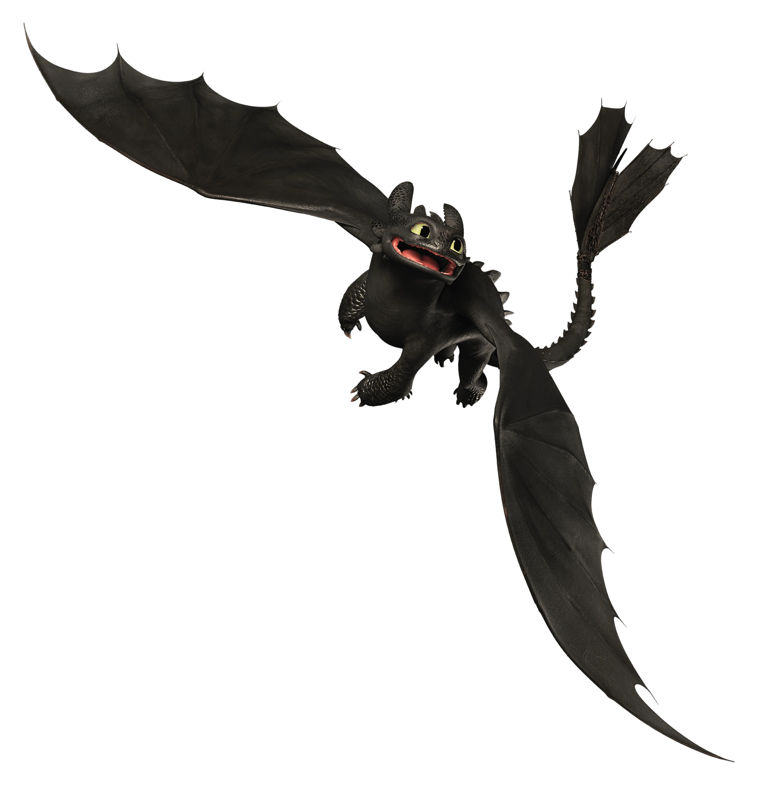
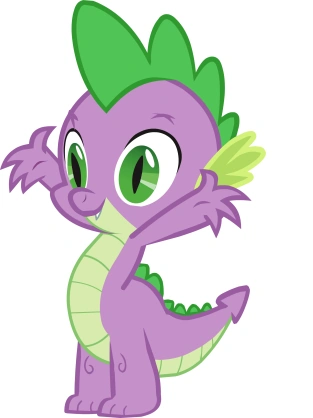
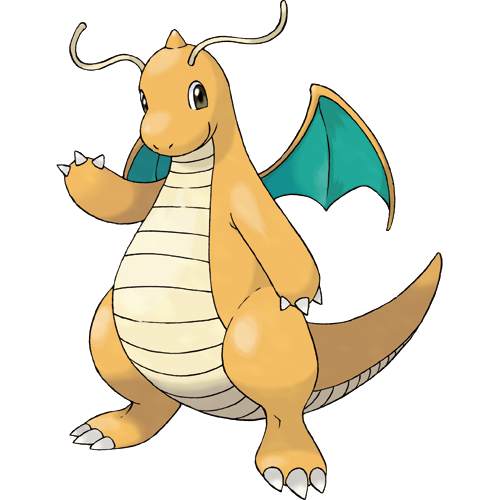

[My repository](https://github.com/qiuhan1008/Assignment7.git)

# Import Nexus Data
```{r, warning=F,message=F}
library(dplyr)
library(Biostrings)
library(ape)
DragonNexus<-read.nexus.data("input/DragonMatrix.nex")
head(DragonNexus)
names(DragonNexus)
```
##Distance matrix
```{r}
DragonNexusDF<-data.frame(matrix(unlist(DragonNexus), ncol=78,byrow=T))
row.names(DragonNexusDF)<-names(DragonNexus)
head(DragonNexusDF)
```

```{r}
DragonDist<-dist(DragonNexusDF,method='binary')
DragonDistMat<-as.matrix(DragonDist)
```

#Vsiualize the matrix

```{r}
WeightsDat<-read.csv("input/Weights.csv")
```

## 1. Create a single vector of weights.
```{r}
Weights<-paste0(WeightsDat$Weight,collapse="")
Weights<-strsplit(Weights,split="")[[1]]
```

## 2. Convert each letter to a value. 
```{r}
LETTERS # See what LETTERS is (see also letters)
which(LETTERS=="G")
WeightsNum<-rep(NA,length(Weights))
for(i in 1:length(WeightsNum)){
  if(Weights[i] %in% LETTERS){
    WeightsNum[i]<-which(LETTERS==Weights[i])+9
  } else {
    WeightsNum[i]<-Weights[i]
  }
}
WeightsNum<-as.numeric(WeightsNum)
```
```{r}
length(WeightsNum)
```

## 3. Multiply the weight value by the trait vector for each dragon.

```{r}
WtDragonNexus<-DragonNexus # Make a new weighted data frame object
for (i in 1:length(DragonNexus)){
  RepWeight<-DragonNexus[[i]]==1
  WtDragonNexus[[i]][RepWeight]<-WeightsNum[RepWeight]
  RepWeight<-NA
}
```

## 4. Re-calculate our distance matrix
```{r}
WtDragonNexusDF<-data.frame(matrix(unlist(WtDragonNexus),ncol=78,byrow=T))
row.names(WtDragonNexusDF)<-names(WtDragonNexus)
WtDragonDist<-dist(WtDragonNexusDF,method='euclidean')
WtDragonDistMat<-as.matrix(WtDragonDist)
```

```{r, warning=F,message=F}
library(reshape2)
PDat<-melt(DragonDistMat)
```

```{r}
library(ggplot2)
# rearrange the data from an n×n matrix to a n2×3 matrix
WtPDat <- melt(WtDragonDistMat)
# plot the matrix
ggplot(data = WtPDat, aes(x = Var1, y = Var2, fill = value)) + 
  geom_tile() + 
  scale_fill_gradientn(colours = c("white","blue","green","red")) +
  theme(axis.text.x = element_text(angle = 90, hjust = 1, vjust = 0.5))
```


# Dragon Phylogeny
## Tree Building
```{r}
WtDragonTree<-fastme.bal(WtDragonDist)
WtDragonTreeNJ <- nj(WtDragonDist)
```

```{r}
# check 'tip.labels'
head(WtDragonTree$tip.label)
```

```{r}
# remove leading numbers
Country <- gsub("[0-9\\.]+([^X]+)X*","\\1", WtDragonTree$tip.label)
# replace the unwanted '3' with 'Unknown'
Country <- gsub("\\d", "Unknown", Country)
# group 'tip.labels' by their corresponding country
CountryGroups <- split(WtDragonTree$tip.label, Country)
names(CountryGroups)
```

```{r}
library(ggtree)
```


```{r}
# use the groupOTU function to apply the grouping information for plotting
WtDTcol <- groupOTU(WtDragonTree, CountryGroups)
str(WtDTcol)
```

## Visualize the Phylogenetic Tree
```{r fig.cap="Phylogenetic tree of dragons. The three dragons of choice (Sisu labeled as Raya, the grafted dragon labeled as EldenRin, and Velkhana) are highlighted in blue."}
# again use the groupOTU function to highlight the selected three groups
WtDTcolHi <- groupOTU(WtDTcol, c(CountryGroups$Toothles,
                                 CountryGroups$Spike,
                                 CountryGroups$Dragonit))
ggtree(WtDTcolHi, layout = "circular", aes(color = group)) + 
  geom_tiplab(size = 2, aes(angle = angle)) +
  scale_colour_manual(name = "Dragon Type", 
                      values = c("blue", "red"), 
                      labels = c("other Dragon", "my Dragon"))
```

# Report

Toothless (Figure 2) is a Night Fury from How To Train Your Dragon franchise. He as black scales covered his entire body. He don't have the left side of the tail-fin. Hiccup, his rider made him a mechanical fin. 
```{r, echo=FALSE, out.width="40%", fig.cap="Toothless from How To Train Your Dragon. Credit to:https://howtotrainyourdragon.fandom.com/wiki/Toothless_(Franchise)", fig.align = 'center'}

```
Spike (Figure 3), from My Little Pony, is a purple and green dragon. He is one of Twilight Sparkle's frind and assistant.
```{r, echo=FALSE, out.width="40%", fig.cap="Spike from My Little Pony. Credit to: https://dragons.fandom.com/wiki/Spike_(My_Little_Pony)", fig.align = 'center'}

```
Dragonite (Figure 4), from Pokemon Go, is a orange dragon. He is the final form of Dratini.
```{r, echo=FALSE, out.width="40%", fig.cap="Dragonite in Pokemon Go. Credit to: https://fantendo.fandom.com/wiki/Dragonite", fig.align = 'center'}

```
According to Figure 1, Toothless and Spike are closely related and have the same ancestor.
